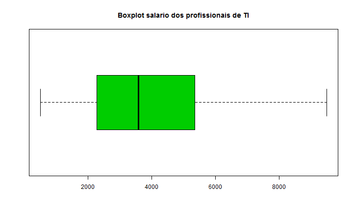

Problema 01
========================================================
Questao 01
--------------------------------------------------------
**A.Trace um esboco do caminho que ele percorreu analisando os dados para responder essas perguntas.**

*O video é bem interessante e em todas as analises que  Hans Rosling faz ele mostra que temos sempre que obsevar as mudanças sociais antes das mudanças economicas para entender como os dados estão mudando. Durante o video para mostrar que não temos mais um mundo tão separada quanto antigamente primeiramente ele analisa dados sobre fertilidade e com dados bons e com taxas de erros pequenas e analisou junto a expecativa de vida e chegou a conclusao que antes paises com indiutrias tinha familias pequenas e vidas longa e os em desenvolvimento tinha familias grandes e vidas curtas mas fazendo uma analise dos dados da decada de 60 até agora os anos 200 os dados se agruparam bastante e agora temos vidas longas e familias pequenas e um mundo totalmente novo como o propio descreve. Em seguida Hans faz uma comparacao entre os dados dos EUA e do Vietnam. Em 1964 os EUA tinham familias pequenas e de vida longa e o Vietnam com familias grandes e vidas curtas. Observou-se nos dados que mesmo durante a guerra houve melhora na expectativa de vida em ambos os paises, ele mostra a evolução dos dados com os anos e cita eventos como o planejamento familiar, a entrada na economia de mercado e desistencia do planejamento comunista, todos acontecidos no Vietnam e mostra que hoje o Vietnam tem a mesma expectativa de vida e o mesmo tamanho de familia dos EUA. Logo após Hans mostra uma pesquisa que mostra que existe uma forte relação entre a mortalidade infantil e o PIB mostrando a distribuição de renda das pessoas de todo o mundo e observa que não existe mais intervalo entre rico e pobre como antigamente mostrando que o conceito de paises em desenvolvimento é duvidoso. Em seguida Hans mostra aonde esta dividida a renda entre os paises e mostra varios casos de como a disribuição de renda é desigual internamente nos paises e em uma visão geral mostra que nos anos 70 a curva de diferença entre ricos e pobre era grande e hoje em dia não é mais. Por fim Hans fala sobre a importancia dos paises com os seus dados.*

**B. Anote os termos ou ideias que voce nao entende ainda**

*Entendi todos os termos e ideias usados no video*

Questao 02
--------------------------------------------------------
**Qual o panorama geral dos profissionais de TI no Brasil sem ainda se preocupar com seus salários, apenas com sua localização, função,expertise...?**


```r
summary(salarios.ti.regiao)
```

```
##        X                     Cidade         UF     Salario.Bruto  
##  Min.   :  1.00   Belo Horizonte:39   MG     :47   Min.   :  500  
##  1st Qu.: 41.25   Rio de Janeiro:16   SP     :25   1st Qu.: 2281  
##  Median : 81.50   Brasília      :12   RJ     :17   Median : 3583  
##  Mean   : 81.50   Campinas      :11   DF     :16   Mean   : 4233  
##  3rd Qu.:121.75   Recife        :10   PE     :10   3rd Qu.: 5332  
##  Max.   :162.00   São Paulo     : 9   BA     : 9   Max.   :42120  
##                   (Other)       :65   (Other):38                  
##  Horas.Diarias   Tempo.de.Empresa Experiencia.Profissional
##  Min.   :4.000   Min.   : 0.000   Min.   : 0.00           
##  1st Qu.:8.000   1st Qu.: 0.600   1st Qu.: 3.00           
##  Median :8.000   Median : 1.080   Median : 5.00           
##  Mean   :7.886   Mean   : 2.076   Mean   : 5.53           
##  3rd Qu.:8.000   3rd Qu.: 2.958   3rd Qu.: 7.00           
##  Max.   :9.000   Max.   :12.000   Max.   :32.00           
##                                                           
##    Iniciativa.Privada.ou.Concursado
##                    :  8            
##  Concursado        : 36            
##  Iniciativa Privada:118            
##                                    
##                                    
##                                    
##                                    
##                                 Cargo    
##  Desenvolvimento Java              :  7  
##  Analista de Sistemas              :  6  
##  Desenvolvedor Java                :  6  
##                                    :  3  
##  Analista de Sistemas/Desenvolvedor:  3  
##  Desenvolvedor                     :  3  
##  (Other)                           :134  
##                                Formacao  Pos.Graduacao.ou.Certificacao
##                                    :29   Mode :logical                
##  Ciência da Computação             :23   FALSE:82                     
##  Bacharel em Ciência da Computação :19   TRUE :80                     
##  Graduação em Ciência da Computação: 6   NA's :0                      
##  Sistemas de Informação            : 5                                
##  Engenharia de Computação          : 4                                
##  (Other)                           :76                                
##           Regiao  
##  Centro-oeste:19  
##  Nordeste    :34  
##  Norte       : 2  
##  Sudeste     :92  
##  Sul         :13  
##  NA's        : 2  
## 
```

*Primeiramente observandos os dados vemos que temos dados metricos e não metricos, sendo eles:*

***Não Metricos:***
<ul>
<li>Cidade</li>
<li>UF</li>
<li>Região</li>
<li>Iniciativa Privada ou Concursado</li>
<li>Pos graduação ou Certificação</li>
<li>Cargo e Formação</li>
</ul>

*Variaveis nominais que vão nos permitir achar proporções/modas, como por exemplo: Qual a região com mais profissionais? ou Qual a proporção de profissionais concursados no Brasil?*

***Metricos:***
<ul>
<li>Horas Diarias</li>
<li>Tempo de Espera</li>
<li>Salario Bruto</li>
<li>Experiencia Profissional</li>
</ul>

*Como são metricas será possivel calcular dirvesos fatores, como por exemplo: media e mediana, quartis e boxplots. E assim responder perguntas como: Qual região tem maiores salarios? Qual região/cidade trabalha por mais tempo?*

*A partir desses dados para poder traçar o panorama analisando os dados por região respondendo as seguintes questões:*

*OBS: Como os dados de Cargos são muito distintos não é interessante avaliar os mesmos*

<li>Como estão divididos os profissionais em TI pelas as regiões do Brasil</li>

```r
table(salarios.ti.regiao$Regiao)
```

```
## 
## Centro-oeste     Nordeste        Norte      Sudeste          Sul 
##           19           34            2           92           13
```

<li>Como estão divididos os profissionais em TI em relação iniciativa de trabalho?</li>

```r
table(salarios.ti.regiao$Iniciativa.Privada.ou.Concursado)
```

```
## 
##                            Concursado Iniciativa Privada 
##                  8                 36                118
```

<li>Qual a relação entre a região de trabalho e a iniciativa?</li>

```r
table(salarios.ti.regiao$Iniciativa.Privada.ou.Concursado,salarios.ti.regiao$Regiao)
```

```
##                     
##                      Centro-oeste Nordeste Norte Sudeste Sul
##                                 2        2     0       4   0
##   Concursado                   11        9     2       8   6
##   Iniciativa Privada            6       23     0      80   7
```

<li>Como estão divididos os profissionais em TI em relaçãoa graduação ou não dos mesmos?</li>

```r
table(salarios.ti.regiao$Pos.Graduacao.ou.Certificacao)
```

```
## 
## FALSE  TRUE 
##    82    80
```

<li>Qual a relação entre o tipo de graduação e a iniciativa de trabalho?</li>

```r
table(salarios.ti.regiao$Iniciativa.Privada.ou.Concursado,salarios.ti.regiao$Pos.Graduacao.ou.Certificacao)
```

```
##                     
##                      FALSE TRUE
##                          3    5
##   Concursado            16   20
##   Iniciativa Privada    63   55
```

<li>Qual proporção de graduados por região?</li>

```r
sort(tapply(salarios.ti.regiao$Pos.Graduacao.ou.Certificacao, salarios.ti.regiao$Regiao, mean), decreasing = TRUE)
```

```
##          Sul Centro-oeste     Nordeste        Norte      Sudeste 
##    0.6923077    0.6842105    0.5000000    0.5000000    0.4239130
```

<li>Media de horas de trabalho por região</li>

```r
sort(tapply(salarios.ti.regiao$Horas.Diarias, salarios.ti.regiao$Regiao, median), decreasing = TRUE)
```

```
## Centro-oeste     Nordeste      Sudeste          Sul        Norte 
##          8.0          8.0          8.0          8.0          7.5
```

<li>Media de tempo de experiencia por região</li>

```r
sort(tapply(salarios.ti.regiao$Experiencia.Profissional, salarios.ti.regiao$Regiao, median), decreasing = TRUE)
```

```
##        Norte Centro-oeste          Sul     Nordeste      Sudeste 
##           11            7            6            5            4
```
Questao 03
--------------------------------------------------------
**Os salários estão bem distribuídos no intervalo que vai do menor salário para o maior salário? Ou será que os salários são muito concentrados em um intervalo pequeno de valores? Será que existem salários atípicos (outliers)?**


```r
summary(salarios.ti.regiao$Salario.Bruto)
```

```
##    Min. 1st Qu.  Median    Mean 3rd Qu.    Max. 
##     500    2281    3583    4233    5332   42120
```


```r
boxplot(salarios.ti.regiao$Salario.Bruto, col = "3", main="Salario dos profissionais de TI", horizontal = T)
```

 

*Fazendo uma primeira analise ao summary e ao boxplot notamos que existem valores atípicos, o que já mostra que os dados não estão bem distribuidos, mas para responder a questão sobre a concentração dos valores no intervalos esses valores foram retirados para melhor vizualisação.*


```r
boxplot(salarios.ti.regiao$Salario.Bruto, col = "3", main="Boxplot salario dos profissionais de TI", horizontal = T, outline=F)
```

 

*Observano o grafico acima nota-se que os valores não estão bem distribuidos porque metade deles estão concentrados abaixo de 3583 (mediana) e o restante se concentra entre 3583 e 9500 (maior salario não levando em conta os outliers). Assim fica evidente a concentração de valores de salarios mais baixos. Isto também pode ser visto através do histograma:*


```r
hist(salarios.ti.regiao$Salario.Bruto, col = "3", main="Histograma salario dos profissionais de TI")
```

 

Questao 04
--------------------------------------------------------
**A distribuição que você encontrou é a que você esperava sem olhar os dados? Se não é, você tem alguma suspeita da razão para a diferença?**

*Quanto a distribuição em torno de valores mais baixos o resultado bate com o que eu esperava mas eu esperava que salarios tão altos não fossem tão atipicos; suspeito que isto aconteceu por conta do pouco volume de dados. Na minha opinião se tivessemos mais dados acho que a medina não mudaria muito mas teriamos mais salarios com grandes valores*


Questao 05
--------------------------------------------------------
**É interessante ver a média (mean) salarial para cada região. Como resultado, apresente uma tabela com o nome da região e a sua média salarial ordenada da região com a maior média salarial para a menor. Se você tivesse usado a mediana (median) em vez da média como métrica de interesse, o resultado seria o mesmo? Analise a situação e justifique. Aproveite e salve esta tabela em um arquivo do tipo csv**

***Utilizando a media***


```r
sort(tapply(salarios.ti.regiao$Salario.Bruto, salarios.ti.regiao$Regiao, mean), decreasing=TRUE)
```

```
## Centro-oeste     Nordeste      Sudeste          Sul        Norte 
##     5620.474     4565.706     3962.227     3657.538     2552.500
```

***Utilizando a mediana***


```r
sort(tapply(salarios.ti.regiao$Salario.Bruto, salarios.ti.regiao$Regiao, median),
decreasing=TRUE)
```

```
## Centro-oeste      Sudeste          Sul     Nordeste        Norte 
##      5000.00      3582.95      3500.00      2900.00      2552.50
```

**Nota-se a diferença entre os valores por causa dos outliers apresentados nos dados.**

**Para salvar os arquvios em csv foram usados os comandos:**


```r
salarioPorRegiaoUsandoMedia <- sort(tapply(salarios.ti.regiao$Salario.Bruto, salarios.ti.regiao$Regiao, mean), decreasing=TRUE)

write.csv(salarioPorRegiaoUsandoMedia, "~/UFCG/analise-de-dados-2/analise-de-dados-2-p1/salarioPorRegiaoUsandoMedia.csv")

salarioPorRegiaoUsandoMediana <- sort(tapply(salarios.ti.regiao$Salario.Bruto, salarios.ti.regiao$Regiao, median), decreasing=TRUE)

write.csv(salarioPorRegiaoUsandoMediana, "~/UFCG/analise-de-dados-2/analise-de-dados-2-p1/salarioPorRegiaoUsandoMediana.csv")
```

Questao 06
--------------------------------------------------------
**Se um profissional de TI deseja ter um salario melhor, qual a(s) dica(s) para ele?**

*Como visto na questão anterior, a região tem um melhor salario é a região Centro Oeste, sendo assim vamos separar os dados desta região e estudalos.*


```r
salarios.centro.oeste <- subset(salarios.ti.regiao, salarios.ti.regiao$Regiao == "Centro-oeste")
```

*Vamos agora comparar os salarios de profissionais graduados e profissionais não graduados*


```r
sort(tapply(salarios.centro.oeste$Salario.Bruto, salarios.centro.oeste$Pos.Graduacao.ou.Certificacao, median), decreasing=TRUE)
```

```
##  TRUE FALSE 
##  5500  3995
```

*Nota-se que profissionais gradudos recebem melhor, agora vamos comparar os salarios dos profissionais que trabalham na iniciativa privada e dos profissionais que trabalham como concursados (Como haviam erros nos dados não informados os mesmos foram ignorados)*


```r
sort(tapply(salarios.centro.oeste$Salario.Bruto, salarios.centro.oeste$Iniciativa.Privada.ou.Concursado, median), decreasing=TRUE)
```

```
##         Concursado Iniciativa Privada 
##               4250               3200
```

*Nota-se que profissionais concursados recebem melhor, Assim a minha dica para o profissional que deseja receber melhor seria que o mesmo seja graduado e concursado na região centro oeste.*


